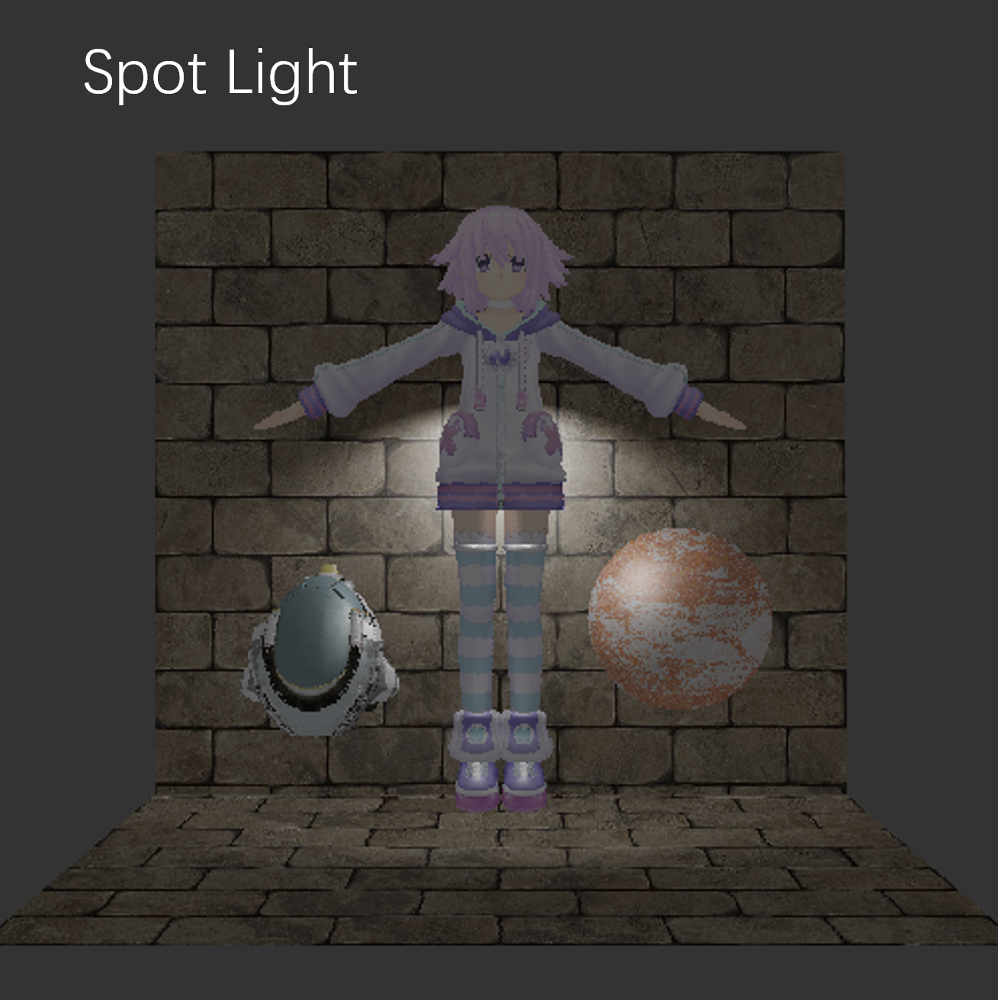
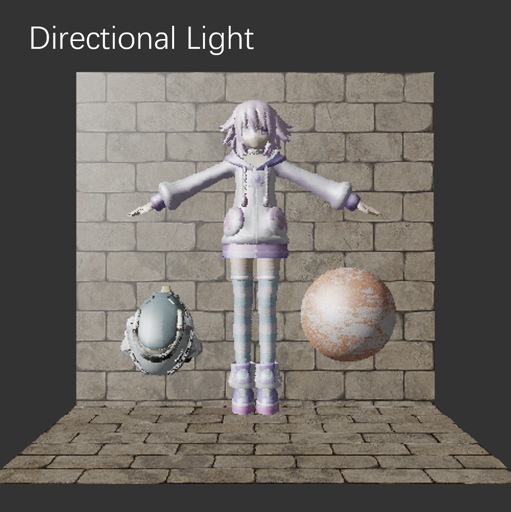
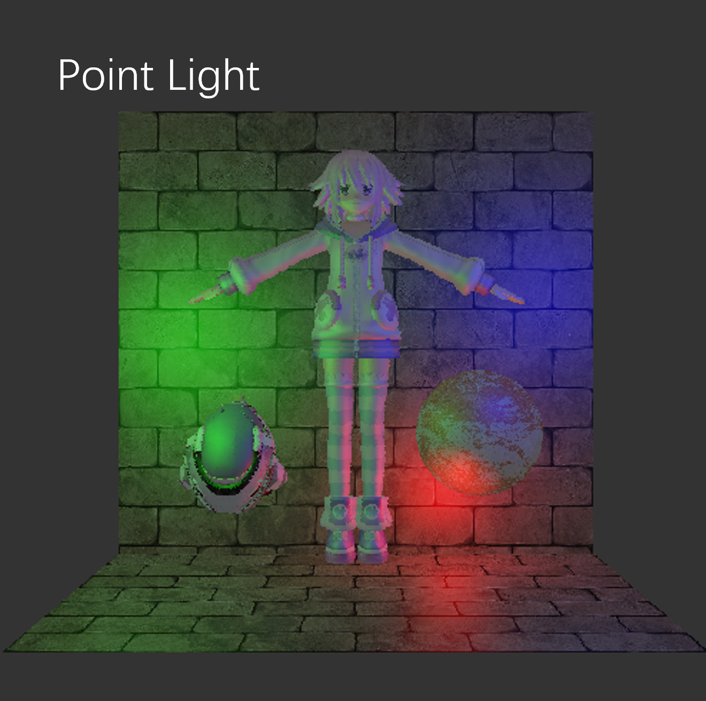

# 项目介绍
本项目是一个基于c++编写的软光栅化渲染器，除了使用stb_image进行贴图加载和qt进行界面展示无其他任何依赖，使用MVVM框架，通过数据绑定机制，将view和model部分对应关联的数据同步起来，的地方有效分离UI层和逻辑层。本项目的MVVM的基本结构图为：

。

# 主要特性

+ 透视插值校正
+ 背向面剔除
+ 视锥剔除
+ Sutherland Hodgeman齐次裁剪
+ 深度测试
+ 线框模型
+ 切线空间的法线贴图
+ 天空盒
+ FPS相机
+ Blinn-Phong光照模型
+ Gouraud光照模型
+ 基于微表面理论的PBR光照模型
+ 常规光源：点光源、方向光、聚光灯

# 相机控制
+ 按住鼠标左键并拖动以实现旋转
+ 滚动鼠标滚轮切换Zoom(轨道相机的直径)大小
+ WASDQE：相机前后移动和左右

# 参考

+ GAMES101
+ GAMES104
+ SRenderer
+ TinySoftRenderer
